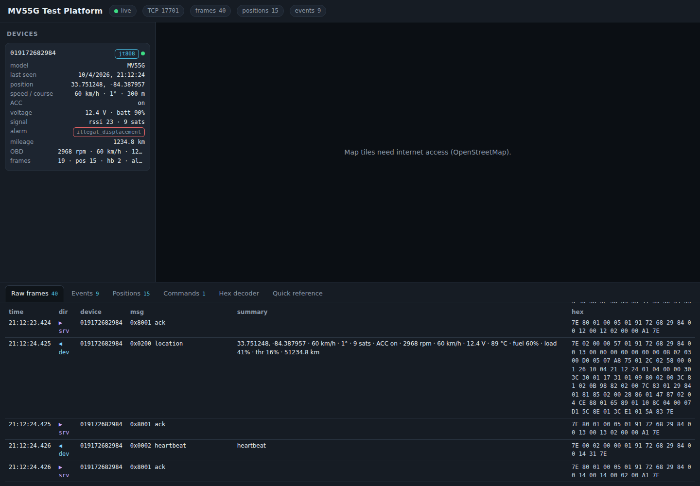

# MiCODUS MV55G-AU — research + test platform

Everything in this folder is about one device: the **MiCODUS MV55G** 4G OBD-II plug-and-play
GPS tracker (we own the **MV55G-AU** regional variant). The goal is to understand the product
well enough to build our own server and app for it, and to have a lab to test against the real
unit.

| Folder / file | What it is |
| --- | --- |
| `docs/RESEARCH-REPORT.md` | Cited research report: hardware, SMS commands, wire protocol, cloud platform, security history |
| `docs/PROTOCOL.md` | The wire protocol as implemented here (JT/T 808 for the MV55G, GT06 for the MV7xx family), byte by byte |
| `docs/SMS-COMMANDS.md` | SMS / online command cheat sheet for the MV55G |
| `docs/TEST-PLAN.md` | Step-by-step bench and in-car test plan for the real device |
| `server/` | The test platform (Node.js, zero dependencies): TCP server, decoders, REST API, live dashboard, simulator, 66 tests |

## The one thing to know first

The MV55G does **not** speak the common GT06/Concox protocol of the older MiCODUS MV720/MV730.
It speaks **JT/T 808** (Traccar calls it `huabao`, port 5015): `0x7E`-delimited frames, XOR
checksum, and it identifies itself with **`0` + the 11-digit MiCODUS ID printed on the device**,
not with the IMEI. OBD-II values (RPM, speed, coolant, voltage, fuel, VIN, DTCs) ride inside the
location report as vendor "additional information" items. Details and sources: `docs/PROTOCOL.md`
§0 and `docs/RESEARCH-REPORT.md`.

## Quick start (no hardware needed)

```bash
cd micodus-mv55g/server
node src/index.js                      # TCP 7700 for the tracker, http://localhost:8080 dashboard
# second terminal
node simulator/simulate.js --obd       # a fake MV55G (JT808) drives around Atlanta and reports every 5 s
node simulator/simulate.js --protocol gt06   # a fake MV7xx (GT06) instead
node --test                            # 66 tests: framing, CRC/XOR, every message type, TCP + HTTP integration
```

Open <http://localhost:8080>: devices on the left (protocol badge, OBD block, alarms), live map
in the middle, and at the bottom the raw frame log (hex + decoded JSON), events, positions, a
command console and an offline hex decoder for pasted captures.



(The map tiles were blocked in the environment where this screenshot was taken; on a normal
internet connection OpenStreetMap tiles load.)

Environment variables: `TCP_PORT` (7700), `HTTP_PORT` (8080), `DATA_DIR` (`server/data`, set `""`
to disable JSONL persistence), `JT808_TZ_HOURS` (offset the device applies to its timestamps,
default 0), `JT808_TEXT_FLAG` (flag byte of 0x8300 commands, default 1), `FORCE_PROTOCOL`
(`jt808` or `gt06` to skip auto-detection), `ACK_EXTENDED=1` (also ACK GT06 `79 79` frames).

## Connecting the real MV55G

The device keeps a server host:port in flash; by default it is MiCODUS' cloud
(`d.micodus.net:7700`). Repoint it by SMS (exact spelling and sources in `docs/SMS-COMMANDS.md`,
procedure in `docs/TEST-PLAN.md`):

1. Change the default password (`123456`) first.
2. `APN,<apn>#` (or `APN,<apn>,<user>,<password>#`) for the SIM you installed.
3. `SERVER,0,<public ip>,7700#` (IP) or `SERVER,1,<dns name>,7700#` (domain), then `RESET#`.
4. Watch the dashboard: a `0x0100 register` with the device ID should appear within a minute,
   then `0x0102 auth`, heartbeats and `0x0200` location reports.

The device lives on the cellular network, so the TCP port must be reachable from the internet:
a cheap VPS running this server, a port-forward on your router, or an SSH/ngrok TCP tunnel from
your laptop all work. Keep the port firewalled to the carrier's address range if you can.

## Architecture

```
 MV55G ──LTE──▶ internet ──▶ :7700  src/tcp-server.js
                                   │  protocol detect (src/protocols.js): 0x7E → jt808, 0x78 → gt06
                                   │  frame parser → decoder → Store ; replies + queued commands back
                                   ▼
                              src/store.js  ── JSONL files in data/ (raw, positions, events, commands)
                                   ▼
                              :8080 src/http-api.js  ── REST + Server-Sent Events ── web/index.html
```

- `src/jt808/` — framing (escaping, XOR, 2013 + 2019 editions), encoder, decoder with the MiCODUS
  OBD items and alarm bits.
- `src/gt06/` — the Concox family (CRC-16/X-25 framing, login/location/heartbeat/alarm/info/OBD).
- `simulator/simulate.js` — a complete fake device for either protocol (register/login, heartbeat,
  route driving, OBD, alarms, batch upload, replies to commands, reconnect) and `--replay file.hex`
  to resend captured frames, which is how real MV55G captures feed back into the decoder.

## What is verified vs. assumed

- **Verified from public sources about the MV55G/MV55G-AU:** JT/T 808 framing, 12-digit ID,
  SMS syntax for APN/SERVER, default server and port, OBD items 0x80–0x8E (from a live capture).
- **Inferred from the family / Traccar:** exact scales of a few OBD items, the reply message to
  0x8300 text commands, the timestamp offset, which alarm bits the firmware uses.
- The server was built for that uncertainty: it never drops bytes, acknowledges every message so
  the device stays connected, and shows unknown message IDs, unknown items and leftover bytes in
  the raw log. `docs/PROTOCOL.md` §8 lists what to confirm from the first captures.

## Safety / scope notes

- This is our own device, tested on our own vehicles and our own server.
- MiCODUS devices had serious published vulnerabilities in 2022 (default password, unauthenticated
  SMS). Change the password, use a SIM with a private/limited plan, and keep the test server
  firewalled.
- Never use the relay / engine-cut features (JT808 0x8500, GT06 relay commands) during a test.
