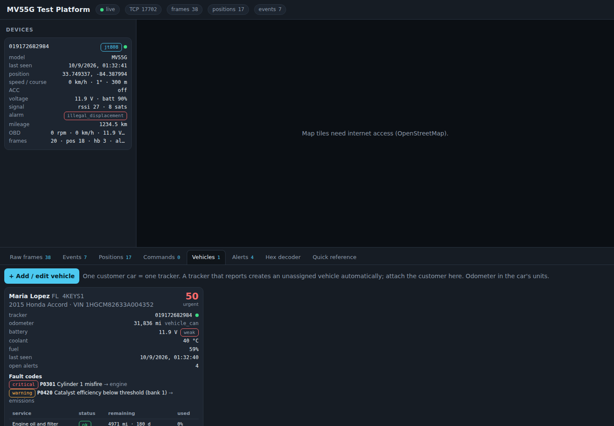
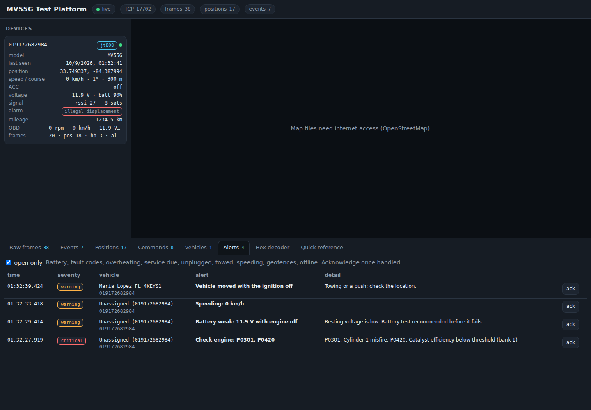

# Vehicle care subscription built on the MV55G

The goal: every customer car with one of our trackers becomes a recurring relationship.
The tracker reports position and engine data to **our** server; the server turns that into
alerts and reminders; each alert is a reason to call the customer with a service they
already need. This document checks what the device can really deliver for each feature,
what it cannot, and how the pieces fit together commercially.

## 1. What the device can feed, feature by feature

| Feature the customer sees | Data from the MV55G | Feasible | Notes / confidence |
| --- | --- | --- | --- |
| Live location, history, trips | GPS every N seconds, buffered points after dead zones, ACC on/off | **Yes** | Core function, verified for the model |
| Mileage log (tax, resale) | Vehicle CAN odometer (item 0x8C) when the car exposes it; else the tracker's own trip counter (item 0x01) plus the odometer the customer gives us at enrolment | **Yes** | Odometer from CAN is the clean case; the counter plus offset works on every car |
| Oil change reminder | Distance and days since the last service (from odometer + calendar) | **Yes** | OBD-II has no "oil life %" or oil level on ordinary cars; shops schedule oil by distance/time anyway |
| Other service reminders (tires, brakes, filters, coolant, plugs, battery age, fob battery, inspection) | Same distance/calendar engine, intervals per car | **Yes** | Default intervals in `maintenance.js`, overridable per vehicle |
| Check-engine alerts with plain-language explanation | DTC list (item 0xA0) | **Yes** | 100+ common codes described with severity and "lead type"; unknown codes still classified |
| Battery health (the number one locksmith/road-call lead) | External voltage (item 0x82, sent with every fix, confirmed on a live MV55G) with engine state | **Yes** | Resting voltage below 12.2 V = weak, below 11.8 V = critical; low voltage with the engine running = alternator |
| Overheating warning | Coolant temperature (item 0x84) | **Yes** | 105 °C warning, 115 °C critical |
| Fuel level | Fuel level % (item 0x8E) | **Likely** | Vendor-listed; confirm on the first in-car capture |
| Unplugged / tamper alert | Alarm bit 8 (main power cut), backup battery keeps reporting 1–2 h | **Yes** | Theft or "a mechanic pulled it" |
| Tow / moved while off, vibration | Alarm bit 28 (illegal displacement), vibration alarms via `SENALM` | **Yes** | Confirm which bit the firmware uses (test plan stage 4) |
| Harsh driving, speeding, idling | Item 0x57 harsh bits, overspeed alarm bit 1 or our own threshold, ACC + speed 0 | **Yes** | Driver behaviour for family or small-fleet plans |
| Geofences (home, work, school, shop) | Our server computes from positions | **Yes** | Circles today; polygons are a small addition |
| RPM, engine load, throttle, intake data | Items 0x81, 0x83, 0x86–0x89 | **Yes** | Useful for diagnostics, less for the customer |
| VIN auto-detect | Item 0x94/0x8B | **Yes** | Fills the vehicle record and enables recall / parts lookups |
| Tire pressure (TPMS) | Not on standard OBD-II PIDs | **No** | Would need a TPMS sensor kit |
| Brake pad wear, oil level, oil pressure value | Not on standard OBD-II for most cars | **No** | Only via oil-pressure DTCs (P0520–P0524) which we do catch |
| Manufacturer-specific module data (BCM, keys, immobiliser) | The MV55G reads generic OBD-II over CAN, not proprietary module data | **No** | But U-codes and B-codes it reports are exactly the leads for module programming work |
| Remote engine cut | JT808 vehicle control exists on the protocol | **Never enable** | Liability; also the feature the 2022 CVEs exposed |

Capability source: items observed on a live MV55G capture and the vendor's parameter list
(see `RESEARCH-REPORT.md` §3.4). Everything marked "confirm" is settled by the first week of
real captures.

## 2. How the service works (what is built)

```
tracker ──▶ server ──▶ vehicle record (customer, plate, VIN, units, service log, geofences)
                 │
                 ├─▶ rules.js     battery / charging / coolant / DTC / fuel / speed / harsh / idle / geofence / unplug / tow / offline
                 ├─▶ maintenance  distance + calendar schedule per item, "due soon" at 90 %, "overdue" at 100 %
                 └─▶ health score 0–100 (good ≥ 85, attention ≥ 60, urgent below)
                                   │
                                   ▼
                     alerts (severity, title, plain-language detail, lead type) ──▶ dashboard, REST, SSE,
                                                                                    later: SMS / WhatsApp / push
```

- **Vehicles tab** in the dashboard: add a customer car, pick the tracker, enter the odometer,
  see health, battery, coolant, fuel, fault codes with descriptions, the maintenance table,
  open alerts, and log a completed service (which resets the item and closes its alerts).
  When the car reports its own odometer over CAN that value is the source of truth and a
  manual entry that disagrees by more than 5 % is flagged.
- **Alerts tab**: every alert with severity, one-click acknowledge.




- **API** for the customer app: `GET /api/vehicles`, `GET /api/vehicles/:id`,
  `POST /api/vehicles`, `POST /api/vehicles/:id` (update), `POST /api/vehicles/:id/service`,
  `GET /api/alerts?open=1`, `POST /api/alerts/:id/ack`, `GET /api/dtc/P0301`,
  `GET /api/schedule`, plus the `alert` event on `/api/stream`.
- Everything persists in `data/vehicles.json` and `data/alerts.jsonl`.
- Simulator scenarios to demo it without a car: `--obd --dtc`, `--obd --weak-battery`,
  `--obd --hot`, `--obd --engine-off`.

## 3. The recurring-revenue loop

Each alert type maps to a service the business already sells or can partner for:

| Alert | Who gets it | The follow-up |
| --- | --- | --- |
| Battery weak / critical, charging low | Customer + shop queue | Mobile battery test and replacement before the no-start call |
| DTC with lead `key` / `module` / `comms` (immobiliser, lost communication, body module) | Shop queue | Module programming / key work: exactly the scope of the diagnostic business |
| DTC with lead `engine` / `emissions` / `transmission` | Customer + shop | Diagnosis visit or partner repair shop referral |
| Oil / tires / brakes / filters due | Customer | Service booking (own or partner), reminder cadence keeps the brand present |
| Coolant high | Customer (urgent) | Stop-driving advice, tow coordination, repair referral |
| Unplugged / tow / geofence | Customer | Theft response; also catches "another shop removed the tracker" |
| Key fob battery (calendar item) | Customer | Fob battery and spare-key offer, the locksmith's own product |
| Annual inspection / registration | Customer | Calendar touchpoint |

Plan shape that fits the data: a monthly fee per vehicle covering the SIM data line,
tracking app, health alerts and maintenance reminders; discounted labour on services
triggered by alerts; family / small-fleet pricing for multiple cars under one account
(the vehicle record already supports several vehicles per customer name).

Cost inputs to price it: tracker hardware (one-time), an IoT SIM with ~5 to 20 MB/month
(reports every 30 s use far less than a phone), server hosting (one small VPS runs hundreds
of trackers), and the time to install (plug in, two SMS commands, assign in the dashboard).

## 4. Onboarding a customer car (10 minutes)

1. Check the car is OBD-II (1996+ US) and the port location; note the odometer.
2. Insert SIM, plug the tracker in, send `APN,<apn>#` and `SERVER,0,<ip>,7700#`, then
   `RESET#` (details in `SMS-COMMANDS.md`). Change the device password.
3. Within a minute the tracker appears in the dashboard. Open **Vehicles → Add / edit**,
   pick the tracker, enter customer name, phone, plate, make/model/year, units and the
   odometer. VIN fills itself when the car reports it.
4. Log the services done today (oil, tires) so the schedule starts from real dates.
5. Add geofences if the customer wants arrival/departure alerts.
6. Give the customer the consent form (next section) and the app access.

## 5. Rules of the road (do these before selling it)

- **Written consent.** Tracking a vehicle requires the owner's consent; for a car driven by
  someone other than the owner (spouse, employee, teenager) the owner must disclose it.
  State laws differ (Florida and Georgia both regulate tracking devices); keep a signed
  consent per vehicle and a way to stop tracking on request.
- **Data retention.** Keep raw positions for a fixed period (for example 90 days) and
  aggregate the rest (trips, mileage). Delete on cancellation.
- **Security.** Change every device password from `123456`, keep the server port
  firewalled to the carrier's ranges or a private APN, never expose relay/engine-cut
  commands, and use per-customer logins in the app (the device ID must not be the login).
- **No safety-critical promises.** Alerts are "we noticed", not a guarantee; the product
  wording in the app and contract should say so.

## 6. What remains to confirm with the real unit

The items marked "confirm" above, the alarm bits used by the firmware, the timestamp
offset, and which message carries command replies. All are covered by `TEST-PLAN.md`;
none of them changes the product design, only thresholds and labels.
